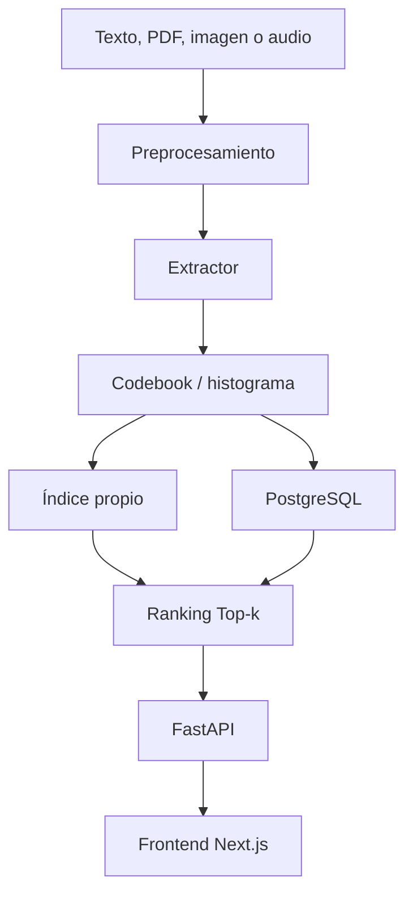

# TriModal Retrieval

Este proyecto es un buscador multimodal para texto, imágenes y audio. La idea fue construir un mismo flujo de recuperación para datos de naturalezas distintas y comparar nuestra implementación con alternativas en PostgreSQL.

- Informe técnico completo: [docs/INFORME_TECNICO.md](docs/INFORME_TECNICO.md)
- Presentación en PDF: [bd2_proyecto2.pdf](bd2_proyecto2.pdf)
- Presentación original: [Canva](https://canva.link/6w43yqgg9iwkh0e)

## Sobre El Proyecto

Este repositorio nace como Proyecto 2 del curso de Base de Datos 2. El objetivo no era solo hacer una interfaz de búsqueda, sino entender cómo se puede representar texto, imágenes y audio de una forma comparable para poder indexarlos, consultarlos y medir su rendimiento.

El sistema toma una consulta en una de estas modalidades:

- texto escrito o PDF;
- imagen subida por el usuario;
- archivo de audio o grabación desde el navegador.

Luego convierte esa entrada en una representación numérica, busca elementos parecidos y muestra los resultados ordenados por similitud.

También se implementó una comparación con PostgreSQL:

- para texto se usa búsqueda full-text con `tsvector` e índice GIN;
- para imagen y audio se usa pgvector con HNSW.

## Qué Se Puede Hacer

- Buscar documentos por texto.
- Buscar documentos a partir del contenido de un PDF.
- Subir una imagen y recuperar imágenes similares.
- Subir o grabar audio y recuperar audios similares.
- Elegir entre la implementación propia y PostgreSQL.
- Ver métricas básicas de la consulta desde la interfaz.
- Ejecutar experimentos de latencia, throughput, Precision@10 y Recall@10 cuando aplica.

## Idea General De La Arquitectura

El pipeline principal sigue esta forma:

```text
Datos de entrada
      |
Preprocesamiento / split
      |
Extracción de características
      |
Codebook / histograma
      |
Índice y ranking
      |
Resultados
```

En el código esto se reparte principalmente así:

```text
bd2-proyecto2/
|-- backend/                  # API, pipelines, extractores, índices y pruebas
|-- frontend/                 # Interfaz web en Next.js
|-- db/                       # Inicialización de PostgreSQL y pgvector
|-- experiments/              # Benchmarks, resultados y gráficas
|-- scripts/                  # Descarga y preparación de datasets
|-- data/                     # Datos de muestra y datos locales
|-- docs/                     # Informe técnico y documentos auxiliares
`-- docker-compose.yml        # Servicios del proyecto
```

Vista general:



## Modalidad De Texto

Para texto se usa un flujo clásico de recuperación de información. Primero se fragmentan los documentos con `SplitText`. Luego `TFIDFExtractor` normaliza el texto, elimina stopwords, aplica stemming y calcula frecuencias de términos. Con eso se arma un codebook textual y cada documento queda representado como un histograma TF-IDF.

La búsqueda propia usa un índice invertido y similitud coseno. Para construirlo se usa el algoritmo SPIMI, el cual escribe en disco los bloques parciales y luego se fusionan para formar el índice final.

Archivos principales:

- `backend/src/extractor/tfidf.py`
- `backend/src/codebook/codebook_text.py`
- `backend/src/index/inverted_index.py`
- `backend/src/index/spimi.py`
- `experiments/bench_text.py`

En PostgreSQL, la búsqueda textual combina `websearch_to_tsquery` con una variante OR por términos para hacer las consultas más flexibles.

## Modalidad De Imágenes

Para imágenes se usa SIFT sobre la imagen completa. Los descriptores pasan por RootSIFT y luego se agrupan con K-Means para formar un vocabulario visual. Además se agrega información de color con histogramas HSV.

La representación final tiene 116 dimensiones:

- 100 palabras visuales SIFT;
- 16 bins de color HSV.

La implementación propia compara histogramas con distancia L2. La versión en base de datos usa pgvector con HNSW sobre `vector(116)`.

Archivos principales:

- `backend/src/extractor/sift.py`
- `backend/src/codebook/codebook_kmeans.py`
- `backend/src/index/visual_search.py`
- `backend/api/image_pipeline.py`
- `experiments/bench_image.py`

## Modalidad De Audio

Para audio se usan ventanas de señal y coeficientes MFCC. Cada audio se transforma en frames MFCC y luego se representa con un histograma de palabras acústicas. El codebook actual usa 512 clusters.

La implementación propia compara esos histogramas con distancia L2. En PostgreSQL se usa pgvector con HNSW sobre `vector(512)`.

Archivos principales:

- `backend/src/split/split_audio.py`
- `backend/src/extractor/mfcc.py`
- `backend/src/index/audio_search.py`
- `backend/api/mfcc_pipeline.py`
- `experiments/bench_audio.py`

## Implementación Propia Vs PostgreSQL

| Modalidad | Implementación propia | PostgreSQL |
| --- | --- | --- |
| Texto | TF-IDF + índice invertido + SPIMI con bloques en disco | `tsvector` + GIN + búsqueda websearch/OR |
| Imagen | SIFT + RootSIFT + BoVW + HSV | pgvector HNSW |
| Audio | MFCC + Bag of Audio Words | pgvector HNSW |

La comparación no busca decir que una opción sea siempre mejor. En escalas pequeñas, los índices propios suelen tener poco overhead. En escalas más grandes, PostgreSQL empieza a ser más atractivo por persistencia, manejo del índice y estructuras especializadas.

## Tecnologías Usadas

Backend y experimentos:

- Python
- FastAPI
- NumPy
- NLTK
- OpenCV
- librosa
- scikit-learn
- PyMuPDF
- matplotlib
- psutil

Base de datos:

- PostgreSQL
- pgvector
- GIN
- HNSW

Frontend:

- Next.js
- React
- TypeScript
- Tailwind CSS
- lucide-react

Infraestructura:

- Docker Compose
- Bash scripts para preparación de datos

## Cómo Ejecutarlo

La forma más directa es usar Docker Compose.

```bash
cp .env.example .env
docker compose up -d --build
```

Servicios:

| Servicio | URL |
| --- | --- |
| Frontend | `http://localhost:3000` |
| Backend | `http://localhost:8000` |
| PostgreSQL | `localhost:5432` |

Para revisar que todo esté arriba:

```bash
docker compose ps
curl -s http://localhost:8000/health
curl -s http://localhost:8000/pipeline/status
```

## Variables De Entorno

El proyecto usa `.env.example` como base:

```env
POSTGRES_USER=bd2
POSTGRES_PASSWORD=bd2
POSTGRES_DB=bd2_proyecto2
POSTGRES_PORT=5432
BACKEND_PORT=8000
FRONTEND_PORT=3000
NEXT_PUBLIC_API_URL=http://localhost:8000
KAGGLE_USERNAME=
KAGGLE_KEY=
APP_INDEX_FULL_DATA=0
APP_MAX_TEXT_DOCS=10000
APP_MAX_IMAGES=10000
APP_MAX_AUDIO_FILES=10000
```

Por defecto `APP_INDEX_FULL_DATA=0`, para que la demo arranque con datos de muestra. Si se quiere indexar data completa al iniciar, se puede activar `APP_INDEX_FULL_DATA=1`, pero el arranque tarda más.

## Datasets

El repositorio no descarga automáticamente todos los datasets grandes. Para los experimentos se usan:

- AG News para texto;
- Fashion200K para imágenes;
- FMA 100K WAV para audio.

Descarga general:

```bash
docker compose --profile datasets run --rm --build datasets
```

Descarga por modalidad:

```bash
docker compose --profile datasets run --rm --build datasets bash scripts/download_data.sh agnews
docker compose --profile datasets run --rm --build datasets bash scripts/download_data.sh fashion200k
docker compose --profile datasets run --rm --build datasets bash scripts/download_data.sh fma-audio
```

Para FMA se necesitan credenciales de Kaggle:

```env
KAGGLE_USERNAME=tu_usuario
KAGGLE_KEY=tu_api_key
```

## Pruebas

```bash
docker compose exec backend python -m pytest -q
```

El informe técnico registra una corrida de pruebas con `126 passed, 1 warning`.

## Experimentos

Para validar rápido con escala 1K:

```bash
docker compose exec backend python experiments/prepare_data.py
docker compose exec backend python experiments/bench_text.py --scales 1k
docker compose exec backend python experiments/bench_image.py --scales 1k
docker compose exec backend python experiments/bench_audio.py --scales 1k
docker compose exec backend python experiments/plot_results.py
```

Para correr todas las escalas:

```bash
docker compose exec backend python experiments/prepare_data.py
docker compose exec backend python experiments/bench_text.py --scales 1k 10k 100k
docker compose exec backend python experiments/bench_image.py --scales 1k 10k 100k
docker compose exec backend python experiments/bench_audio.py --scales 1k 10k 100k
docker compose exec backend python experiments/plot_results.py
```

El benchmark de texto también permite probar distintos tamaños de diccionario para justificar mejor el valor de `k`:

```bash
docker compose exec backend python experiments/bench_text.py --scales 1k --codebook-sizes 250 500 1000 2000
```

Ese comando genera:

```text
experiments/results/text_codebook_k_results.json
```

## Resultados

Los resultados guardados están en:

- `experiments/results/text_results.json`
- `experiments/results/image_results.json`
- `experiments/results/audio_results.json`

### Resumen:

En las métricas, el `@10` significa que la evaluación se hace sobre los primeros 10 resultados devueltos por la búsqueda, es decir, el Top 10. `Precision@10` indica qué proporción de esos 10 resultados fue relevante. `Recall@10` indica qué proporción de todos los elementos relevantes del dataset logró aparecer dentro de ese Top 10.

| Modalidad | Escala | Elementos indexados | Latencia propia (ms) | Latencia PostgreSQL (ms) | Precision@10 propia | Precision@10 PostgreSQL | Recall@10 propia | Recall@10 PostgreSQL |
| --- | ---: | ---: | ---: | ---: | ---: | ---: | ---: | ---: |
| Texto | 1K | 1,001 | 1.171 | 10.951 | 0.584 | 0.550 | 0.0234 | 0.0221 |
| Texto | 10K | 10,008 | 13.322 | 35.115 | 0.690 | 0.730 | 0.0028 | 0.0029 |
| Texto | 100K | 100,054 | 187.956 | 113.094 | 0.766 | 0.795 | 0.0003 | 0.0003 |
| Imagen | 1K | 996 | 2.587 | 9.866 | 0.242 | 0.225 | 0.0123 | 0.0121 |
| Imagen | 10K | 9,966 | 22.953 | 11.108 | 0.284 | 0.310 | 0.0015 | 0.0016 |
| Imagen | 100K | 99,619 | 315.680 | 14.839 | 0.314 | 0.295 | 0.0002 | 0.0001 |
| Audio | 1K | 1,000 | 2.100 | 11.922 | 0.732 | 0.780 | 0.0115 | 0.0123 |
| Audio | 10K | 9,989 | 28.916 | 13.540 | 0.122 | 0.115 | 0.0018 | 0.0018 |
| Audio | 100K | 99,847 | 313.680 | 317.831 | 0.026 | 0.020 | 0.0004 | 0.0003 |

Para texto, Precision@K y Recall@K se sustentan usando la categoría de AG News como ground truth. Un resultado se considera relevante si pertenece a la misma categoría que la consulta. La consulta misma se excluye del Top-k para no contar una coincidencia trivial.

Esto no reemplaza juicios humanos de relevancia, pero es una forma reproducible de medir efectividad con los datos disponibles. En 100K, por ejemplo, Precision@10 queda cerca entre ambos enfoques: 0.766 para el índice propio y 0.795 para PostgreSQL GIN.

## Limitaciones

- Los datasets completos son grandes y no se incluyen todos en el repositorio.
- Los índices propios de imagen y audio hacen comparación lineal en memoria.
- `init.sh` conserva algunas instrucciones antiguas de datasets.

## Autores

- Anthony Romero
- Hanks Vargas
- María Tamayo
- Sofía Ku

La licencia del repositorio atribuye copyright a `LuixRom`.

## Licencia

Este repositorio usa licencia MIT. Ver [LICENSE](LICENSE).
