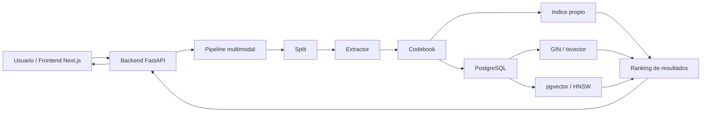
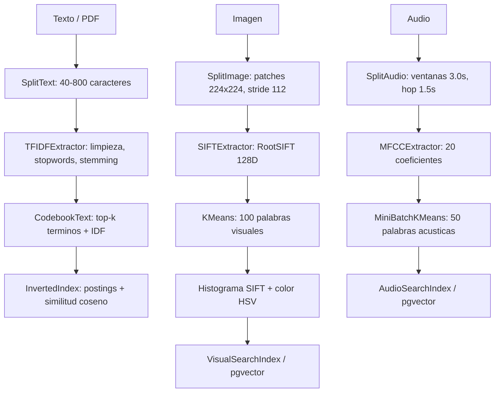

# Sistema multimodal de recuperación y búsqueda

Proyecto 2 del curso Base de Datos 2. El sistema implementa un motor de búsqueda multimodal para texto, imágenes y audio usando una arquitectura común:

```text
Split -> Extractor -> Codebook -> Indice Invertido
```

La idea es llevar datos de naturalezas distintas a una representación comparable. Para texto se usan tokens y pesos TF-IDF; para imágenes se usan descriptores SIFT y un histograma visual; y para audio se usan MFCC y un histograma acústico. Luego se compara nuestra implementación con PostgreSQL usando GIN para texto y pgvector con HNSW para imagen/audio.

Presentación del proyecto: [Canva](https://canva.link/6w43yqgg9iwkh0e)

> **Nota post-entrega:** este README mantiene el informe base presentado originalmente. Las correcciones realizadas después de la entrega se documentan explícitamente como modificaciones post-entrega dentro de cada sección afectada y se resumen en la sección 9.

## 1. Objetivo

El objetivo del proyecto fue construir un sistema de recuperación que soporte varias modalidades sin diseñar un motor distinto para cada una. Para lograrlo, cada modalidad adapta sus propios métodos de extracción, pero respeta el mismo contrato final: un `chunk_id`, una modalidad, un histograma y metadatos.

El sistema permite:

- Buscar documentos por texto o por PDF.
- Buscar imágenes similares subiendo una imagen.
- Buscar audios similares subiendo un archivo o grabando desde el micrófono.
- Comparar el enfoque propio contra PostgreSQL nativo.
- Medir latencia, throughput, Precision@10 y comportamiento al escalar.

## 2. Arquitectura

### 2.1. Arquitectura general



El frontend solo se encarga de recibir la consulta y mostrar resultados. La lógica principal está en FastAPI, donde se cargan los pipelines, se construyen histogramas y se consultan tanto los índices propios como PostgreSQL.

### 2.2. Flujo por modalidad presentado originalmente



**Modificación post-entrega:** el flujo activo fue corregido en tres puntos:

- Texto: `InvertedIndex` ahora se construye con bloques SPIMI.
- Imagen: SIFT ya no se aplica sobre patches artificiales en el pipeline principal; se extrae sobre la imagen completa.
- Audio: el codebook acústico se aumentó de 50 a 512 clusters MFCC.

## 3. Implementación por módulo

### 3.1. Split

El módulo de split convierte archivos grandes en unidades pequeñas para indexación.

| Modalidad | Implementación original | Decisiones principales |
|---|---|---|
| Texto | `SplitText` | Fragmentos entre 40 y 800 caracteres. Se separa por párrafos y, si un párrafo es muy largo, se divide por oraciones. También soporta PDF usando PyMuPDF. |
| Imagen | `SplitImage` | Patches de 224x224 px con stride 112 en el pipeline de la app. Para benchmarks de Tiny ImageNet se usaban patches de 32x32 con stride 16 porque las imágenes eran de 64x64 px. |
| Audio | `SplitAudio` | En el pipeline MFCC se usan ventanas de 3.0 s con hop de 1.5 s a 22050 Hz. En benchmarks GTZAN se usaban ventanas de 1.0 s con hop de 0.5 s para obtener más chunks por canción. |

Esta etapa conserva metadatos como ruta de origen, posición del patch, página del PDF, tiempos de inicio/fin del audio y tamaño original del chunk.

**Modificación post-entrega:** por observación del docente, el pipeline visual activo dejó de usar `SplitImage` antes de SIFT. SIFT se extrae sobre la imagen completa para no alterar artificialmente la distribución de keypoints. El módulo `SplitImage` puede permanecer en el repositorio como componente probado/auxiliar, pero ya no define el flujo principal de búsqueda visual.

### 3.2. Extractor

| Modalidad | Extractor | Detalle técnico |
|---|---|---|
| Texto | `TFIDFExtractor` | Normaliza a minúsculas, elimina caracteres no alfabéticos, tokeniza con NLTK, elimina stopwords y aplica Snowball stemming. En el pipeline se usan términos crudos para construir histogramas con IDF. |
| Imagen | `SIFTExtractor` | Usa OpenCV SIFT. Cada descriptor tiene 128 dimensiones. Se aplica RootSIFT para mejorar comparación por similitud. Si un patch o imagen no tiene keypoints, se retorna un arreglo vacío controlado. |
| Audio | `MFCCExtractor` | Extrae 20 coeficientes MFCC por frame con `librosa`. Aplica pre-enfasis 0.97, `n_fft=2048`, `hop_length=512` y 128 bandas Mel. |

Además existe un pipeline musical para Spotify que usa letras con TF-IDF y 12 atributos numéricos de audio (`danceability`, `energy`, `tempo`, etc.) normalizados entre mínimo y máximo.

**Modificación post-entrega:** en el flujo activo de imagen, el extractor SIFT recibe la imagen completa y no una lista de patches. En audio se mantiene MFCC como extractor, pero el vocabulario acústico se aumentó en la etapa de codebook.

### 3.3. Codebook

El codebook reduce características a un vocabulario discreto.

| Modalidad | Codebook original | Tamaño presentado |
|---|---|---:|
| Texto en app | `CodebookText` | 200 términos |
| Texto en benchmarks | `CodebookText` | 500 términos |
| Imagen en app | K-Means + HSV | 100 clusters SIFT + 16 bins de color |
| Imagen en benchmarks | MiniBatchKMeans | 50 clusters SIFT |
| Audio | MiniBatchKMeans | 50 clusters MFCC |

En imagen, el pipeline de la app combina dos señales: histograma SIFT y color HSV. El vector de imagen de la app tiene 116 dimensiones: 100 visual words + 16 bins de color. Este detalle se refleja en PostgreSQL usando `vector(116)`.

**Modificación post-entrega:** se hicieron estos ajustes para alinear implementación y experimentación:

- Texto en benchmarks usa `CodebookText` con 1000 términos.
- Imagen en benchmarks ahora usa 100 clusters SIFT + 16 bins HSV, para coincidir con `vector(116)` en pgvector.
- Audio usa 512 clusters MFCC, por lo que PostgreSQL debe tener `pg_audio_docs.embedding vector(512)`.

### 3.4. Índices y ranking

| Índice | Uso | Métrica de búsqueda |
|---|---|---|
| `InvertedIndex` | Texto | Postings por codeword y similitud coseno. |
| `VisualSearchIndex` | Imagen | Distancia L2 entre histogramas normalizados. |
| `AudioSearchIndex` | Audio | Distancia L2 entre histogramas acústicos. |
| PostgreSQL GIN | Texto | `tsvector` + `plainto_tsquery`. |
| pgvector HNSW | Imagen/audio | Distancia vectorial L2 con índice HNSW. |

El índice propio vive en memoria y prioriza baja latencia. PostgreSQL agrega persistencia, consultas SQL y estructuras más preparadas para crecer.

**Modificación post-entrega:** SPIMI ya se usa al construir el índice textual mediante `build_with_spimi`. En imagen y audio la solución propia sigue usando búsqueda vectorial lineal sobre histogramas; la versión persistente/escalable se compara con pgvector/HNSW.

## 4. Aplicaciones implementadas

### 4.1. Búsqueda textual y PDF

El usuario puede escribir una consulta o subir un PDF. El backend extrae texto del PDF con PyMuPDF, lo consulta contra el índice textual y devuelve fragmentos/documentos con `score`, título, fuente y snippet. También se puede comparar contra PostgreSQL GIN.

**Modificación post-entrega:** el backend ahora devuelve también el contenido completo del resultado textual (`content`) y el frontend agrega el botón **Ver texto completo / Ver menos**. Esto permite inspeccionar el documento/chunk completo sin limitarse al snippet.

### 4.2. Búsqueda visual

El usuario sube una imagen. En la versión presentada, el sistema dividía la imagen en patches, extraía SIFT, construía el histograma visual y recuperaba imágenes similares. En el frontend se muestran tarjetas con miniatura, ranking y porcentaje de similitud.

**Modificación post-entrega:** la búsqueda visual activa ya no divide la imagen en patches para SIFT. Ahora extrae SIFT sobre la imagen completa y mantiene el histograma HSV global como señal complementaria de color.

### 4.3. Búsqueda por audio

El usuario puede subir un archivo de audio o grabar desde el micrófono. El frontend convierte la grabación a WAV y la envía al backend. El backend extrae MFCC, construye el histograma acústico y busca canciones/audios similares. También existe comparación con pgvector.

**Modificación post-entrega:** el vocabulario acústico pasó de 50 a 512 clusters MFCC para representar mejor la variabilidad de los frames acústicos. Esto aumenta dimensión, costo de entrenamiento y memoria, pero produce histogramas más expresivos.

### 4.4. Búsqueda musical por letras y atributos

Si se carga el CSV de Spotify, el sistema permite búsqueda musical por letras y por características numéricas de audio. Para letras se usa el mismo flujo textual; para atributos se normalizan 12 features y se consulta por similitud.

**Estado post-entrega:** el pipeline activo para audio crudo/MFCC es `mfcc_pipeline.py`. El archivo `music_pipeline.py` aparece en el repositorio como componente separado/no conectado al arranque principal, por lo que no se considera parte del flujo multimodal activo.

## 5. Datasets

Los datos grandes no se versionan completos. En la entrega original se contemplaban estos datasets:

| Dataset | Modalidad | Características | Uso |
|---|---|---|---|
| AG News | Texto | 120,000 noticias cortas en 4 clases balanceadas: World, Sports, Business y Sci/Tech. | Benchmarks de texto en 1K, 10K y 100K documentos. |
| GTZAN Genre Dataset | Audio | 1,000 canciones WAV de 30 s, 10 géneros, 100 canciones por género. | Evaluación acústica. El máximo real fue cercano a 60K chunks por límite del dataset. |
| Tiny ImageNet | Imagen | 110,000 imágenes RGB de 64x64 px, 200 clases. | Benchmarks de imagen en 1K, 10K y 100K imágenes. |
| SciMMIR / arXiv | Texto + imagen | Papers o abstracts con posible contenido visual asociado. | Datos de prueba para búsqueda documental multimodal. |
| Spotify songs | Audio + letras | Canciones con letras y atributos como energía, tempo, valence y danceability. | Búsqueda musical por letra y atributos de audio. |
| Fashion product images | Imagen | Imágenes de productos de moda. | Caso de búsqueda visual tipo e-commerce. |

**Modificación post-entrega:** para que las escalas sean realmente por archivo/documento fuente y no por chunks internos, se actualizó la preparación de datasets:

| Dataset actual | Modalidad | Origen | Escalas |
|---|---|---|---|
| AG News | Texto | HuggingFace `fancyzhx/ag_news` | 1K, 10K y 100K documentos |
| Fashion200K | Imagen | HuggingFace `Marqo/fashion200k` | 1K, 10K y 100K imágenes |
| FMA 100K WAV | Audio | Kaggle `noahbadoa/fma-dataset-100k-music-wav-files` | 1K, 10K y 100K archivos de audio |

La unidad de escala experimental es el archivo/documento fuente. Por ejemplo, `audio_10k.json` contiene 10,000 archivos de audio, no 10,000 ventanas/chunks.

Estructura local esperada después de la preparación actual:

```text
data/
├── samples/
└── full/
    ├── agnews/
    ├── fashion200k/
    ├── audio/fma_100k/
    └── .kaggle_cache/
```

### 5.1. Descarga de datasets con Docker

La forma recomendada post-entrega es usar el servicio `datasets` de Docker Compose. Los datos se descargan al volumen local `./data:/app/data`, por lo que no quedan dentro de la imagen Docker.

Para FMA se requieren credenciales de Kaggle en `.env`:

```powershell
Copy-Item .env.example .env
notepad .env
```

Agregar:

```env
KAGGLE_USERNAME=tu_usuario
KAGGLE_KEY=tu_api_key
```

Descargar todo:

```powershell
docker compose --profile datasets run --rm --build datasets
```

Descargar solo una modalidad:

```powershell
docker compose --profile datasets run --rm --build datasets bash scripts/download_data.sh agnews
docker compose --profile datasets run --rm --build datasets bash scripts/download_data.sh fashion200k
docker compose --profile datasets run --rm --build datasets bash scripts/download_data.sh fma-audio
```

Si se descarga en local fuera de Docker:

```bash
./scripts/download_data.sh agnews
./scripts/download_data.sh fashion200k
./scripts/download_data.sh fma-audio
./scripts/download_data.sh all
```

## 6. Ejecución con Docker

El proyecto completo se levanta con Docker Compose: PostgreSQL + pgvector, backend FastAPI y frontend Next.js.

### 6.1. Variables de entorno

Crear `.env` desde `.env.example`:

```powershell
Copy-Item .env.example .env
```

Valores por defecto:

```env
POSTGRES_USER=bd2
POSTGRES_PASSWORD=bd2
POSTGRES_DB=bd2_proyecto2
POSTGRES_PORT=5432
BACKEND_PORT=8000
FRONTEND_PORT=3000
NEXT_PUBLIC_API_URL=http://localhost:8000
KAGGLE_USERNAME=
KAGGLE_KEY=
APP_INDEX_FULL_DATA=0
APP_MAX_TEXT_DOCS=10000
APP_MAX_IMAGES=10000
APP_MAX_AUDIO_FILES=10000
```

`APP_INDEX_FULL_DATA` queda en `0` por defecto para que la API arranque rápido con datos de muestra. Los datasets completos de 1K/10K/100K se usan desde los scripts de experimentación. Para una demo con datos significativos sin cargar los 100K completos, se puede activar `APP_INDEX_FULL_DATA=1` y dejar los límites en 10K por modalidad:

```env
APP_INDEX_FULL_DATA=1
APP_MAX_TEXT_DOCS=10000
APP_MAX_IMAGES=10000
APP_MAX_AUDIO_FILES=10000
```

Si se suben esos límites, el backend tardará más en iniciar porque construye los índices al arrancar.

### 6.2. Levantar todo

```powershell
docker compose up -d --build
```

Servicios:

| Servicio | URL / puerto |
|---|---|
| Frontend | `http://localhost:3000` |
| Backend | `http://localhost:8000` |
| PostgreSQL | `localhost:5432` |

Verificar estado:

```powershell
docker compose ps
Invoke-RestMethod http://localhost:8000/health
Invoke-RestMethod http://localhost:8000/pipeline/status
```

**Modificación post-entrega:** como audio cambió de `vector(50)` a `vector(512)`, si ya existía un volumen antiguo de PostgreSQL se debe recrear el esquema:

```powershell
docker compose down -v
docker compose up -d --build
```

Si los datasets se descargaron mientras el backend ya estaba corriendo:

```powershell
docker compose restart backend
```

## 7. Pruebas

La forma recomendada es correr los tests dentro del contenedor backend:

```powershell
docker compose exec backend python -m pytest -q
```

Si los servicios todavía no están levantados:

```powershell
docker compose up -d --build
docker compose exec backend python -m pytest -q
```

Última verificación de la entrega:

```text
126 passed, 1 warning
```

La advertencia corresponde a una deprecación interna de `starlette.testclient` con `httpx`; no bloquea la ejecución del proyecto.

## 8. Evaluación experimental

Los benchmarks están en `experiments/`.

En la entrega original se ejecutaban así:

```bash
docker compose exec backend python experiments/bench_text.py
docker compose exec backend python experiments/bench_image.py
docker compose exec backend python experiments/bench_audio.py
docker compose exec backend python experiments/plot_results.py
```

**Modificación post-entrega:** antes de medir se deben regenerar los manifests para que apunten a los datasets actuales descargados en `data/full/`:

```powershell
docker compose exec backend python experiments/prepare_data.py
```

Ejecución rápida para validar con 1K:

```powershell
docker compose exec backend python experiments/bench_text.py --scales 1k
docker compose exec backend python experiments/bench_image.py --scales 1k
docker compose exec backend python experiments/bench_audio.py --scales 1k
docker compose exec backend python experiments/plot_results.py
```

Ejecución completa para el informe:

```powershell
docker compose exec backend python experiments/bench_text.py --scales 1k 10k 100k
docker compose exec backend python experiments/bench_image.py --scales 1k 10k 100k
docker compose exec backend python experiments/bench_audio.py --scales 1k 10k 100k
docker compose exec backend python experiments/plot_results.py
```

Cada benchmark compara la solución propia contra PostgreSQL cuando la base de datos está disponible:

| Modalidad | Solución propia | Comparación PostgreSQL |
|---|---|---|
| Texto | `InvertedIndex` + codebook textual | PostgreSQL GIN sobre `tsvector` |
| Imagen | `VisualSearchIndex` con SIFT + BoVW/HSV | pgvector/HNSW sobre histogramas visuales |
| Audio | `AudioSearchIndex` con MFCC + BoAW | pgvector/HNSW sobre histogramas acústicos |

### 8.1. Efectividad

En la versión corregida se sigue el criterio de recuperación de información visto en clase. Como no hay juicios manuales de relevancia por consulta, se usa la etiqueta del dataset como ground truth:

- Texto: relevante si pertenece a la misma clase AG News.
- Imagen: relevante si pertenece a la misma categoría Fashion200K.
- Audio: relevante si pertenece al mismo género/carpeta FMA.

La consulta misma se excluye del Top-k para no contar un acierto trivial.

| Métrica | Fórmula | Interpretación |
|---|---|---|
| `precision_at_k` | `TP / (TP + FP)` | De lo recuperado, cuánto fue relevante. |
| `recall_at_k` | `TP / (TP + FN)` | De todo lo relevante disponible, cuánto se encontró. |
| `avg_tp_at_k` | promedio de verdaderos positivos | Aciertos relevantes por consulta. |
| `avg_fp_at_k` | promedio de falsos positivos | Resultados recuperados que no eran relevantes. |
| `avg_fn_at_k` | promedio de falsos negativos | Relevantes no recuperados. |

### 8.2. Resultados y gráficas

Los resultados resumidos se guardan en:

```text
experiments/results/
```

Las gráficas generadas se guardan en:

```text
experiments/grafica_analisis/
```

Archivos principales:

| Archivo | Contenido |
|---|---|
| `experiments/results/text_results.json` | Resultados de texto para 1K, 10K y 100K documentos. |
| `experiments/results/image_results.json` | Resultados de imagen para 1K, 10K y 100K imágenes. |
| `experiments/results/audio_results.json` | Resultados de audio para 1K, 10K y 100K archivos. |

Comparaciones globales generadas post-entrega:

```text
experiments/grafica_analisis/comparison_latency_1k.png
experiments/grafica_analisis/comparison_latency_10k.png
experiments/grafica_analisis/comparison_latency_100k.png
experiments/grafica_analisis/comparison_precision_1k.png
experiments/grafica_analisis/comparison_precision_10k.png
experiments/grafica_analisis/comparison_precision_100k.png
experiments/grafica_analisis/comparison_recall_1k.png
experiments/grafica_analisis/comparison_recall_10k.png
experiments/grafica_analisis/comparison_recall_100k.png
experiments/grafica_analisis/scalability_latency.png
```

### 8.3. Resumen de resultados post-entrega

Los resultados siguientes corresponden a la corrida post-entrega con los datasets actualizados:

- Texto: AG News en 1K, 10K y 100K documentos.
- Imagen: Fashion200K en 1K, 10K y 100K imágenes.
- Audio: FMA 100K WAV en 1K, 10K y 100K archivos.

La unidad de escala es siempre el documento/archivo fuente. En imagen y audio algunos archivos pueden omitirse si no se pueden procesar correctamente; por eso `n_indexed` puede ser ligeramente menor que la escala nominal.

| Modalidad | Escala | Elementos indexados | Latencia propia (ms) | Latencia PostgreSQL (ms) | Precision@10 propia | Precision@10 PostgreSQL | Recall@10 propia | Recall@10 PostgreSQL |
|---|---:|---:|---:|---:|---:|---:|---:|---:|
| Texto | 1K | 1,000 | 0.830 | 10.976 | 0.614 | 1.000 | N/R | N/R |
| Texto | 10K | 10,000 | 10.990 | 15.179 | 0.772 | 1.000 | N/R | N/R |
| Texto | 100K | 100,000 | 114.480 | 9.391 | 0.750 | 1.000 | N/R | N/R |
| Imagen | 1K | 996 | 2.587 | 9.866 | 0.242 | 0.225 | 0.0123 | 0.0121 |
| Imagen | 10K | 9,966 | 22.953 | 11.108 | 0.284 | 0.310 | 0.0015 | 0.0016 |
| Imagen | 100K | 99,619 | 315.680 | 14.839 | 0.314 | 0.295 | 0.0002 | 0.0001 |
| Audio | 1K | 1,000 | 2.100 | 11.922 | 0.732 | 0.780 | 0.0115 | 0.0123 |
| Audio | 10K | 9,989 | 28.916 | 13.540 | 0.122 | 0.115 | 0.0018 | 0.0018 |
| Audio | 100K | 99,847 | 313.680 | 317.831 | 0.026 | 0.020 | 0.0004 | 0.0003 |

`N/R` indica que esa métrica no fue reportada por el archivo de resultados de texto. Para texto sí se reportó `Precision@10`; en imagen y audio se reportaron además `TP`, `FP`, `FN` y `Recall@10`.

### 8.4. Gráficas comparativas

Las siguientes gráficas comparan latencia y precisión entre las tres modalidades y sus respectivas alternativas en PostgreSQL. Cada fila corresponde a una escala experimental.

| Escala | Latencia | Precisión |
|---|---|---|
| 1K |  |  |
| 10K |  |  |
| 100K |  |  |

Gráfica de escalabilidad general:


## 9. Mejoras post-entrega / post-presentación

Después de la presentación se corrigieron varios puntos observados durante la revisión del proyecto. Esta sección no reemplaza lo presentado originalmente; documenta los ajustes realizados para alinear la implementación con las observaciones del docente y con la metodología de recuperación multimedia vista en clase.

| Punto observado | Corrección realizada | Archivos principales |
|---|---|---|
| La experimentación solo reportaba Precision@K y no seguía completamente el esquema de efectividad con TP, FP y FN. | Se agregó cálculo explícito de `TP`, `FP`, `FN`, `Precision@10 = TP/(TP+FP)` y `Recall@10 = TP/(TP+FN)`. También se excluye la consulta misma del Top-k. | `experiments/bench_text.py`, `experiments/bench_image.py`, `experiments/bench_audio.py`, `experiments/plot_results.py` |
| SPIMI estaba implementado, pero no se usaba para construir el índice textual. | `InvertedIndex` ahora puede construirse con bloques SPIMI mediante `build_with_spimi`. El pipeline textual y el benchmark de texto usan esa construcción y reportan `spimi_blocks`. | `backend/src/index/inverted_index.py`, `backend/api/pipeline_state.py`, `experiments/bench_text.py` |
| En imagen, SIFT no debía aplicarse sobre patches artificiales en el pipeline principal. | Se desvinculó `SplitImage` del pipeline SIFT activo. Ahora SIFT se extrae sobre la imagen completa tanto en la app como en el benchmark. | `backend/api/image_pipeline.py`, `experiments/bench_image.py` |
| El benchmark de imagen no coincidía con la dimensión `vector(116)` de PostgreSQL. | Se ajustó a 100 clusters SIFT + 16 bins HSV, igual que la app y pgvector. | `experiments/bench_image.py`, `backend/api/postgres_indexer.py` |
| El codebook acústico de 50 clusters era demasiado pequeño para Bag-of-Audio-Words. | Se aumentó el vocabulario acústico a 512 clusters MFCC. | `backend/api/mfcc_pipeline.py`, `experiments/bench_audio.py`, `backend/api/postgres_indexer.py` |
| La experimentación de audio era demasiado lenta con FMA porque algunos archivos activaban fallbacks de decodificación muy costosos. | El benchmark de audio ahora lee directamente con `soundfile`, omite archivos corruptos/no decodificables y usa una muestra fija de 10 s por archivo para representar cada canción de forma comparable. El codebook se entrena con una muestra acotada de archivos, similar al muestreo usado en imagen. | `experiments/bench_audio.py` |
| Los resultados de texto solo mostraban un snippet. | El backend devuelve `content` y el frontend permite abrir el texto completo del resultado. PostgreSQL GIN también retorna `content`. | `backend/api/pipeline_state.py`, `backend/api/routes/postgres.py`, `frontend/app/page.tsx` |
| Los datasets viejos no cubrían bien 1K, 10K y 100K archivos por modalidad. | Se actualizó la preparación a AG News, Fashion200K y FMA 100K WAV, con manifests por documentos/archivos fuente. | `scripts/download_data.sh`, `experiments/prepare_data.py`, `experiments/prepare_*_data.py` |

## 10. Análisis de resultados

Los resultados post-entrega reemplazan la interpretación numérica de la primera corrida, porque ahora se ejecutan sobre datasets actualizados y con escalas definidas por documentos/archivos fuente.

### 10.1. Texto

En texto, PostgreSQL GIN obtiene `Precision@10 = 1.000` en las tres escalas y mantiene una latencia baja incluso en 100K documentos. Esto confirma que `tsvector` + GIN es una estructura muy fuerte para búsqueda textual clásica, especialmente cuando la consulta y los documentos comparten vocabulario explícito.

El índice propio con SPIMI y codebook TF-IDF tiene muy buena latencia en 1K y 10K (`0.830 ms` y `10.990 ms`), pero en 100K sube a `114.480 ms`. Esto se explica porque, aunque el índice invertido evita comparar contra todos los documentos, el número de candidatos crece con la colección y el ranking por similitud coseno se vuelve más costoso. Aun así, su precisión queda en un rango razonable (`0.614`, `0.772`, `0.750`) para una implementación propia basada en vocabulario limitado.

### 10.2. Imagen

En imagen, la solución propia usa SIFT sobre imagen completa, RootSIFT, un codebook visual de 100 palabras y 16 bins HSV. La precisión mejora ligeramente al crecer la escala: `0.242` en 1K, `0.284` en 10K y `0.314` en 100K. Esto sugiere que, al haber más ejemplos por categoría, el ranking encuentra más vecinos visualmente parecidos.

La latencia del índice propio escala de forma casi lineal porque la búsqueda se realiza comparando histogramas en memoria: `2.587 ms` en 1K, `22.953 ms` en 10K y `315.680 ms` en 100K. PostgreSQL con pgvector/HNSW es más estable en latencia (`9.866 ms`, `11.108 ms`, `14.839 ms`) y por eso se vuelve claramente superior en 100K. En precisión, ambos enfoques quedan cercanos: el índice propio gana en 1K y 100K, mientras pgvector gana en 10K.

### 10.3. Audio

En audio, la precisión cae al crecer la escala: `0.732` en 1K, `0.122` en 10K y `0.026` en 100K. Esto es esperable con FMA porque los géneros musicales son amplios y muchas canciones de géneros distintos pueden compartir timbre, ritmo o instrumentación. Además, el benchmark resume cada archivo usando una ventana acotada de audio para mantener la corrida ejecutable, por lo que no siempre captura toda la estructura musical de la canción.

La latencia muestra el mismo patrón de escalabilidad que imagen. El índice propio es muy rápido en 1K (`2.100 ms`), pero sube a `28.916 ms` en 10K y `313.680 ms` en 100K. pgvector/HNSW queda cerca en 100K (`317.831 ms`) y es más rápido en 10K (`13.540 ms`). En precisión, ambas alternativas son similares: pgvector gana en 1K, mientras la solución propia queda ligeramente arriba en 10K y 100K.

### 10.4. Lectura global

La comparación muestra un patrón claro:

- En escalas pequeñas, los índices propios en memoria son competitivos por su bajo overhead.
- Al crecer a 100K, PostgreSQL se vuelve más atractivo en texto e imagen por sus estructuras especializadas (`GIN` y `HNSW`).
- La efectividad depende mucho de la modalidad y de la calidad del descriptor: texto es el caso más fuerte, imagen queda en un rango medio y audio es el más difícil por la ambigüedad del contenido musical.
- `Recall@10` es bajo en imagen y audio porque hay muchas instancias relevantes por categoría/género, pero solo se recuperan 10 resultados. Por eso `Precision@10` es más útil para evaluar la calidad inmediata del ranking mostrado al usuario.

## 11. Trade-offs

| Enfoque | Ventajas | Limitaciones | Cuándo conviene |
|---|---|---|---|
| Índice propio + codebook | Muy baja latencia, control total del algoritmo, fácil de inspeccionar y explicar. | Vive en memoria, requiere reconstrucción, depende mucho del tamaño del codebook. | Prototipos, demos, colecciones pequeñas/medianas y casos donde se prioriza latencia. |
| PostgreSQL GIN | Muy bueno para texto, persistente, integrado con SQL y ranking full-text. | No aplica directamente a imagen/audio. Requiere preparar `tsvector`. | Búsqueda textual seria, filtros, persistencia y escalabilidad. |
| pgvector HNSW | Permite búsqueda vectorial persistente y aproximada, útil para imagen/audio. | Requiere ajustar parámetros como `m` y `ef_construction`; introduce overhead de base de datos. | Escalas medianas/grandes, persistencia y consultas vectoriales repetibles. |

La conclusión principal es que no hay un ganador único. La implementación propia gana cuando se busca simplicidad y baja latencia. PostgreSQL gana cuando se necesita persistencia, mantenimiento del índice y mejor escalabilidad.

## 12. Conclusiones

El proyecto logró unificar texto, imagen y audio bajo una arquitectura común. Aunque cada modalidad usa técnicas distintas, todas terminan en histogramas de codewords que pueden indexarse y compararse.

Los experimentos post-entrega muestran que no existe un único enfoque ganador para todas las modalidades. En texto, PostgreSQL GIN fue la alternativa más fuerte ya que mantuvo precisión perfecta en la corrida y latencias bajas incluso con 100K documentos. El índice propio con SPIMI sigue siendo valioso porque permite explicar y controlar todo el proceso de construcción del índice invertido, pero su latencia crece cuando aumenta el número de candidatos.

En imagen y audio, los índices propios fueron competitivos en escalas pequeñas por trabajar en memoria, pero su búsqueda lineal sobre histogramas se vuelve costosa al llegar a 100K archivos. pgvector/HNSW ofrece una ruta más estable para escalar y mantener persistencia dentro de PostgreSQL. La precisión en imagen se mantuvo razonable para un enfoque SIFT/BoVW/HSV clásico, mientras que audio fue la modalidad más difícil por la variabilidad de las canciones y la ambigüedad de los géneros.

Como mejoras futuras, se propone aumentar el número de visual words, probar embeddings modernos para imagen/audio, afinar parámetros HNSW, reportar Recall@10 también en texto y seguir optimizando el tiempo de construcción para datasets grandes.

## 13. Estructura del repositorio

```text
bd2-proyecto2/
├── backend/              # API FastAPI y módulos del pipeline
│   ├── api/              # Rutas, pipelines y conexión PostgreSQL
│   ├── src/              # split, extractor, codebook e index
│   └── tests/            # pruebas pytest
├── frontend/             # Interfaz Next.js
├── db/                   # Inicialización PostgreSQL/pgvector
├── experiments/          # Benchmarks, resultados y gráficas
├── scripts/              # Descarga de datasets
├── data/                 # Datos locales
├── docker-compose.yml
└── README.md
```
