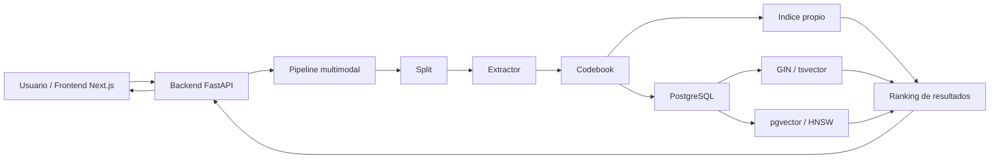
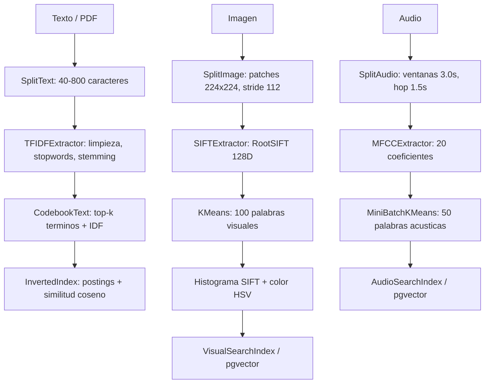
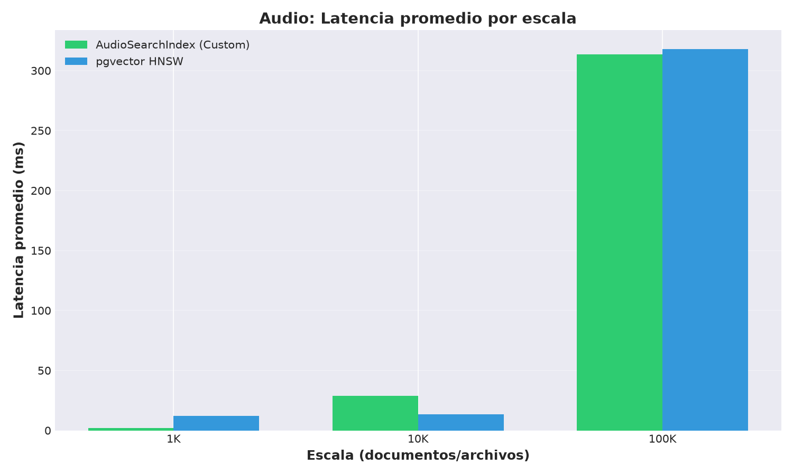
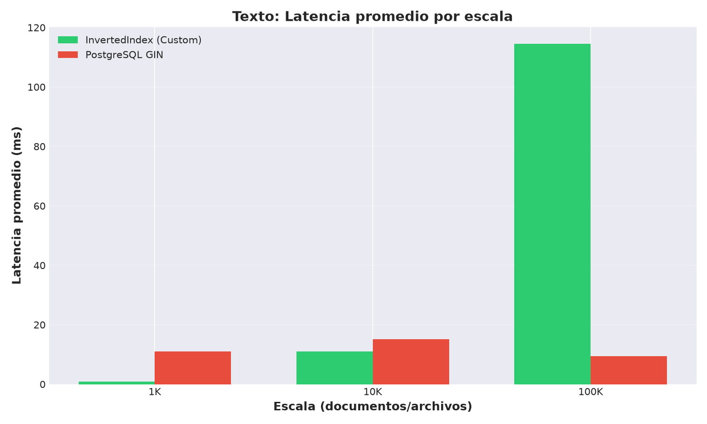
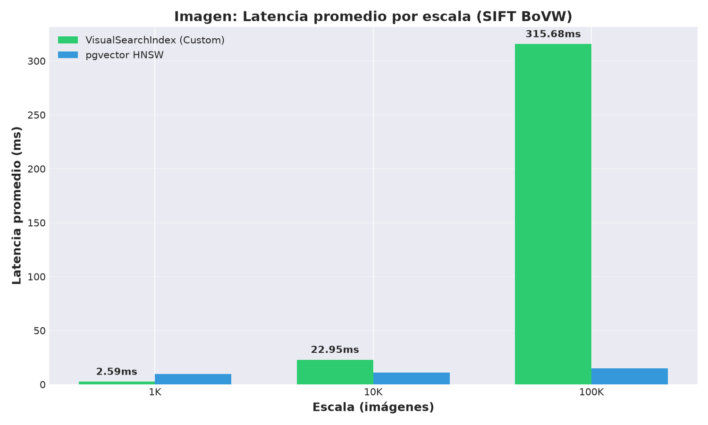
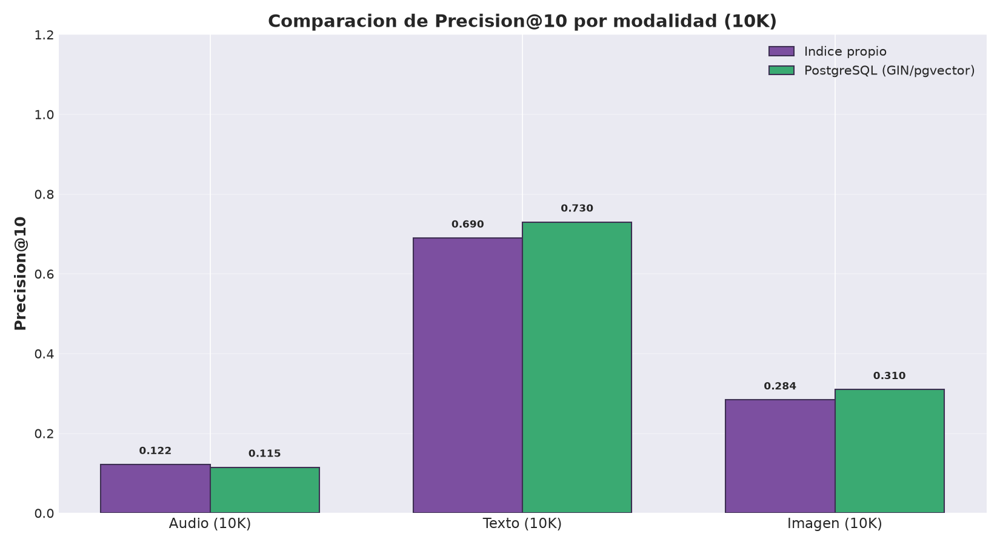
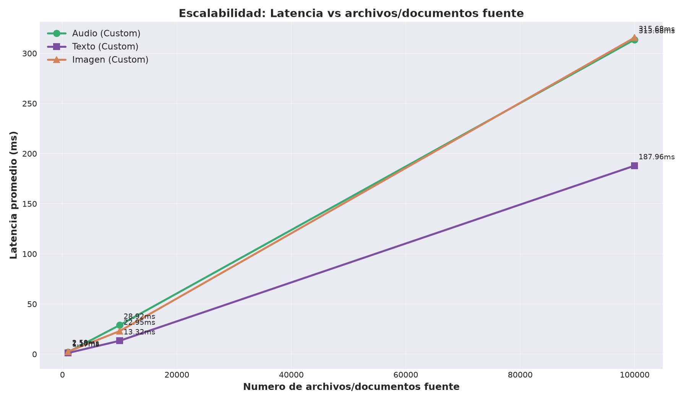

# Sistema multimodal de recuperación y búsqueda

Proyecto 2 del curso Base de Datos 2. El sistema implementa un motor de búsqueda multimodal para texto, imágenes y audio usando una arquitectura común:

```text
Split -> Extractor -> Codebook -> Indice Invertido
```

La idea es llevar datos de naturalezas distintas a una representación comparable. Para texto se usan tokens y pesos TF-IDF; para imágenes se usan descriptores SIFT y un histograma visual; y para audio se usan MFCC y un histograma acústico. Luego se compara nuestra implementación con PostgreSQL usando GIN para texto y pgvector con HNSW para imagen/audio.

Presentación del proyecto: [Canva](https://canva.link/6w43yqgg9iwkh0e)

## 1. Objetivo

El objetivo del proyecto fue construir un sistema de recuperación que soporte varias modalidades sin diseñar un motor distinto para cada una. Para lograrlo, cada modalidad adapta sus propios métodos de extracción, pero respeta el mismo contrato final: un `chunk_id`, una modalidad, un histograma y metadatos.

El sistema permite:

- Buscar documentos por texto o por PDF.
- Buscar imágenes similares subiendo una imagen.
- Buscar audios similares subiendo un archivo o grabando desde el micrófono.
- Comparar el enfoque propio contra PostgreSQL nativo.
- Medir latencia, throughput, Precision@10 y comportamiento al escalar.

## 2. Arquitectura

### 2.1. Arquitectura general



El frontend solo se encarga de recibir la consulta y mostrar resultados. La lógica principal está en FastAPI, donde se cargan los pipelines, se construyen histogramas y se consultan tanto los índices propios como PostgreSQL.

### 2.2. Flujo por modalidad



## 3. Implementación por módulo

### 3.1. Split

El módulo de split convierte archivos grandes en unidades pequeñas para indexación.

| Modalidad | Implementación | Decisiones principales |
|---|---|---|
| Texto | `SplitText` | Fragmentos entre 40 y 800 caracteres. Se separa por párrafos y, si un párrafo es muy largo, se divide por oraciones. También soporta PDF usando PyMuPDF. |
| Imagen | `SplitImage` | Patches de 224x224 px con stride 112 en el pipeline de la app. Para benchmarks de Tiny ImageNet se usan patches de 32x32 con stride 16 porque las imágenes son de 64x64 px. |
| Audio | `SplitAudio` | En el pipeline MFCC se usan ventanas de 3.0 s con hop de 1.5 s a 22050 Hz. En benchmarks GTZAN se usan ventanas de 1.0 s con hop de 0.5 s para obtener más chunks por canción. |

Esta etapa conserva metadatos como ruta de origen, posición del patch, página del PDF, tiempos de inicio/fin del audio y tamaño original del chunk.

### 3.2. Extractor

| Modalidad | Extractor | Detalle técnico |
|---|---|---|
| Texto | `TFIDFExtractor` | Normaliza a minúsculas, elimina caracteres no alfabéticos, tokeniza con NLTK, elimina stopwords y aplica Snowball stemming. En el pipeline se usan términos crudos para construir histogramas con IDF. |
| Imagen | `SIFTExtractor` | Usa OpenCV SIFT. Cada descriptor tiene 128 dimensiones. Se aplica RootSIFT para mejorar comparación por similitud. Si un patch no tiene keypoints, se retorna un arreglo vacío controlado. |
| Audio | `MFCCExtractor` | Extrae 20 coeficientes MFCC por frame con `librosa`. Aplica pre-enfasis 0.97, `n_fft=2048`, `hop_length=512` y 128 bandas Mel. |

Además existe un pipeline musical para Spotify que usa letras con TF-IDF y 12 atributos numéricos de audio (`danceability`, `energy`, `tempo`, etc.) normalizados entre mínimo y máximo.

### 3.3. Codebook

El codebook reduce características a un vocabulario discreto.

| Modalidad | Codebook | Tamaño usado |
|---|---|---:|
| Texto en app | `CodebookText` | 200 términos |
| Texto en benchmarks | `CodebookText` | 500 términos |
| Imagen en app | K-Means | 100 clusters SIFT + 16 bins de color |
| Imagen en benchmarks | MiniBatchKMeans | 50 clusters SIFT |
| Audio | MiniBatchKMeans | 50 clusters MFCC |

En imagen, el pipeline de la app combina dos señales: 60% histograma SIFT y 40% histograma de color HSV. Por eso el vector final de imagen en la app tiene 116 dimensiones: 100 visual words + 16 bins de color. Este detalle también se refleja en PostgreSQL usando `vector(116)`.

### 3.4. Índices y ranking

| Índice | Uso | Métrica de búsqueda |
|---|---|---|
| `InvertedIndex` | Texto | Postings por codeword y similitud coseno. |
| `VisualSearchIndex` | Imagen | Distancia L2 entre histogramas normalizados. |
| `AudioSearchIndex` | Audio | Distancia L2 entre histogramas acústicos. |
| PostgreSQL GIN | Texto | `tsvector` + `plainto_tsquery`. |
| pgvector HNSW | Imagen/audio | Distancia vectorial L2 con índice HNSW. |

El índice propio vive en memoria y prioriza baja latencia. PostgreSQL agrega persistencia, consultas SQL y estructuras más preparadas para crecer.

## 4. Aplicaciones implementadas

### 4.1. Búsqueda textual y PDF

El usuario puede escribir una consulta o subir un PDF. El backend extrae texto del PDF con PyMuPDF, lo consulta contra el índice textual y devuelve fragmentos/documentos con `score`, título, fuente y snippet. También se puede comparar contra PostgreSQL GIN.

### 4.2. Búsqueda visual

El usuario sube una imagen. El sistema divide la imagen en patches, extrae SIFT, construye el histograma visual y recupera imágenes similares. En el frontend se muestran tarjetas con miniatura, ranking y porcentaje de similitud.

### 4.3. Búsqueda por audio

El usuario puede subir un archivo de audio o grabar desde el micrófono. El frontend convierte la grabación a WAV y la envía al backend. El backend extrae MFCC, construye el histograma acústico y busca canciones/audios similares. También existe comparación con pgvector.

### 4.4. Búsqueda musical por letras y atributos

Si se carga el CSV de Spotify, el sistema permite búsqueda musical por letras y por características numéricas de audio. Para letras se usa el mismo flujo textual; para atributos se normalizan 12 features y se consulta por similitud.

## 5. Datasets

Los datos grandes no se versionan completos. Se descargan localmente con:

```bash
./scripts/download_data.sh arxiv
./scripts/download_data.sh spotify
./scripts/download_data.sh fashion
```

| Dataset | Modalidad | Características | Uso |
|---|---|---|---|
| AG News | Texto | 120,000 noticias cortas en 4 clases balanceadas: World, Sports, Business y Sci/Tech. | Benchmarks de texto en 1K, 10K y 100K documentos. |
| GTZAN Genre Dataset | Audio | 1,000 canciones WAV de 30 s, 10 géneros, 100 canciones por género. | Evaluación acústica. El máximo real fue ~60K chunks por límite del dataset. |
| Tiny ImageNet | Imagen | 110,000 imágenes RGB de 64x64 px, 200 clases. | Benchmarks de imagen en 1K, 10K y 100K imágenes. |
| SciMMIR / arXiv | Texto + imagen | Papers o abstracts con posible contenido visual asociado. | Datos de prueba para búsqueda documental multimodal. |
| Spotify songs | Audio + letras | Canciones con letras y atributos como energía, tempo, valence y danceability. | Búsqueda musical por letra y atributos de audio. |
| Fashion product images | Imagen | Imágenes de productos de moda. | Caso de búsqueda visual tipo e-commerce. |

Estructura local esperada:

```text
data/
├── samples/
└── full/
    ├── scimmir/
    ├── spotify_songs.csv
    └── audio/
```

## 6. Ejecución con Docker

El proyecto completo se levanta con Docker Compose: PostgreSQL + pgvector, backend FastAPI y frontend Next.js.

### 6.1. Variables de entorno

Crear `.env` desde `.env.example`:

```bash
cp .env.example .env
```

Valores por defecto:

```env
POSTGRES_USER=bd2
POSTGRES_PASSWORD=bd2
POSTGRES_DB=bd2_proyecto2
POSTGRES_PORT=5432
BACKEND_PORT=8000
FRONTEND_PORT=3000
NEXT_PUBLIC_API_URL=http://localhost:8000
```

### 6.2. Levantar todo

```bash
docker compose up --build
```

En segundo plano:

```bash
docker compose up -d --build
```

Servicios:

| Servicio | URL / puerto |
|---|---|
| Frontend | `http://localhost:3000` |
| Backend | `http://localhost:8000` |
| PostgreSQL | `localhost:5432` |

Verificar estado:

```bash
docker compose ps
curl http://localhost:8000/health
```

Si ya existía un volumen antiguo de PostgreSQL y se cambió el esquema, reiniciar desde cero:

```bash
docker compose down -v
docker compose up -d --build
```

## 7. Pruebas

La forma recomendada es correr los tests dentro del contenedor backend:

```bash
docker compose exec backend python -m pytest -q
```

Última verificación realizada:

```text
126 passed, 1 warning
```

La advertencia corresponde a una deprecación interna de `starlette.testclient` con `httpx`; no bloquea la ejecución del proyecto.

## 8. Evaluación experimental

Los benchmarks están en `experiments/`:

```bash
docker compose exec backend python experiments/bench_text.py
docker compose exec backend python experiments/bench_image.py
docker compose exec backend python experiments/bench_audio.py
docker compose exec backend python experiments/plot_results.py
```

Los resultados resumidos se guardan en:

```text
experiments/results/
```

Las gráficas generadas se guardan en:

```text
experiments/grafica_analisis/
```

### 8.1. Tabla resumen

| Modalidad | Escala | Latencia propia | P@10 propio | Latencia PostgreSQL | P@10 PostgreSQL |
|---|---:|---:|---:|---:|---:|
| Audio | 1K | 0.037 ms | 1.000 | 9.163 ms | 1.000 |
| Audio | 10K | 0.292 ms | 0.990 | 8.077 ms | 1.000 |
| Audio | 60K | 1.706 ms | 0.432 | 8.176 ms | 0.460 |
| Texto | 1K | 0.83 ms | 0.614 | 10.976 ms | 1.000 |
| Texto | 10K | 10.99 ms | 0.772 | 15.179 ms | 1.000 |
| Texto | 100K | 114.48 ms | 0.750 | 9.391 ms | 1.000 |
| Imagen | 1K | 1.721 ms | 0.108 | 9.801 ms | 0.243 |
| Imagen | 10K | 20.811 ms | 0.112 | 8.825 ms | 0.103 |
| Imagen | 100K | 191.058 ms | 0.112 | 9.469 ms | 0.120 |

### 8.2. Gráficas











## 9. Análisis de resultados

En audio, el índice propio tuvo la mejor latencia. En 1K y 10K fue claramente más rápido que pgvector porque todo se resuelve en memoria y con histogramas pequeños. En 60K la precisión baja porque GTZAN tiene géneros musicales con mucho solapamiento real. Por ejemplo, blues, jazz y rock pueden compartir instrumentos, ritmo o timbre.

En texto, PostgreSQL GIN fue el enfoque más sólido en precisión. El `tsvector` recuperó documentos de la misma categoría con P@10 de 1.0 en todas las escalas medidas. El índice propio fue competitivo en escalas pequeñas, pero en 100K la latencia subió bastante porque la búsqueda en memoria compara más candidatos y no tiene las optimizaciones internas de GIN.

En imagen, pgvector fue más estable cuando aumentó el volumen. El enfoque propio depende mucho del tamaño del vocabulario visual. Con pocos codewords, varios objetos visualmente distintos pueden terminar con histogramas parecidos. Por eso la precisión se mantuvo baja alrededor de 0.11. Para mejorar esta parte sería recomendable aumentar el codebook visual o usar embeddings profundos.

## 10. Trade-offs

| Enfoque | Ventajas | Limitaciones | Cuándo conviene |
|---|---|---|---|
| Índice propio + codebook | Muy baja latencia, control total del algoritmo, fácil de inspeccionar y explicar. | Vive en memoria, requiere reconstrucción, depende mucho del tamaño del codebook. | Prototipos, demos, colecciones pequeñas/medianas y casos donde se prioriza latencia. |
| PostgreSQL GIN | Muy bueno para texto, persistente, integrado con SQL y ranking full-text. | No aplica directamente a imagen/audio. Requiere preparar `tsvector`. | Búsqueda textual seria, filtros, persistencia y escalabilidad. |
| pgvector HNSW | Permite búsqueda vectorial persistente y aproximada, útil para imagen/audio. | Requiere ajustar parámetros como `m` y `ef_construction`; introduce overhead de base de datos. | Escalas medianas/grandes, persistencia y consultas vectoriales repetibles. |

La conclusión principal es que no hay un ganador único. La implementación propia gana cuando se busca simplicidad y baja latencia. PostgreSQL gana cuando se necesita persistencia, mantenimiento del índice y mejor escalabilidad.

## 11. Conclusiones

El proyecto logró unificar texto, imagen y audio bajo una arquitectura común. Aunque cada modalidad usa técnicas distintas, todas terminan en histogramas de codewords que pueden indexarse y compararse.

Los experimentos muestran que el índice propio funciona muy bien como motor en memoria, especialmente en audio y escalas pequeñas. Sin embargo, PostgreSQL ofrece ventajas importantes cuando el volumen crece o cuando se necesita persistencia. GIN fue superior en texto, mientras que pgvector resultó más estable para imagen y audio en escalas grandes.

Como mejoras futuras, se propone aumentar el número de codewords visuales, probar embeddings modernos para imagen/audio, afinar parámetros HNSW y automatizar la descarga/preparación de datasets para que todos los benchmarks se puedan reproducir sin rutas manuales.

## 12. Estructura del repositorio

```text
bd2-proyecto2/
├── backend/              # API FastAPI y módulos del pipeline
│   ├── api/              # Rutas, pipelines y conexión PostgreSQL
│   ├── src/              # split, extractor, codebook e index
│   └── tests/            # pruebas pytest
├── frontend/             # Interfaz Next.js
├── db/                   # Inicialización PostgreSQL/pgvector
├── experiments/          # Benchmarks, resultados y gráficas
├── scripts/              # Descarga de datasets
├── data/                 # Datos locales
├── docker-compose.yml
└── README.md
```
