# Informe Técnico Final

## Sistema Multimodal De Recuperación Y Búsqueda

Este documento describe la versión final del proyecto. Para una presentación más breve del repositorio, instrucciones de ejecución y resumen general, revisar el [README principal](../README.md).

## 1. Objetivo

El objetivo del proyecto fue construir un sistema de recuperación de información capaz de trabajar con tres modalidades: texto, imágenes y audio. En lugar de implementar un motor totalmente distinto para cada tipo de dato, se diseñó un flujo común basado en:

```text
Preprocesamiento -> Extractor -> Codebook -> Índice -> Ranking
```

Cada modalidad usa extractores propios, pero todas terminan en una representación comparable mediante histogramas o vectores de codewords. Sobre esas representaciones se realizan búsquedas por similitud y se comparan dos enfoques:

- una implementación propia en memoria;
- una implementación persistente usando PostgreSQL, GIN y pgvector/HNSW.

## 2. Arquitectura General

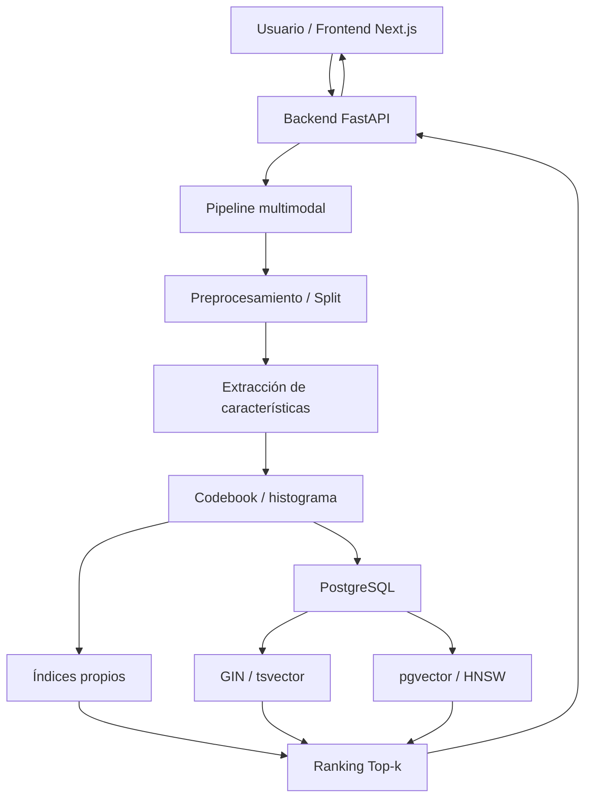

El frontend permite seleccionar modalidad, enfoque de búsqueda y número de resultados. La API en FastAPI carga los pipelines, construye las representaciones de consulta y ejecuta la búsqueda en el índice propio o en PostgreSQL.

## 3. Flujo Por Modalidad

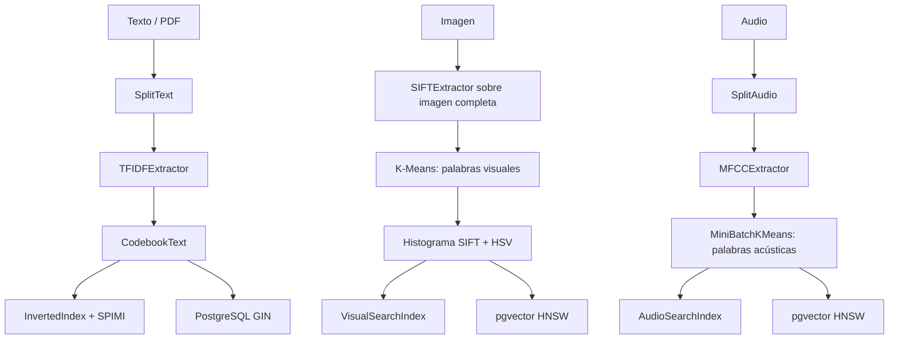

## 4. Modalidad Textual

### 4.1. Preprocesamiento

El módulo `SplitText` divide documentos en fragmentos. También soporta archivos PDF mediante PyMuPDF, lo que permite buscar a partir del contenido extraído de un documento.

Archivo principal:

- `backend/src/split/split_text.py`

### 4.2. Extracción

La extracción textual se realiza con `TFIDFExtractor`. El flujo aplica:

- conversión a minúsculas;
- limpieza de caracteres;
- tokenización con NLTK;
- eliminación de stopwords;
- stemming con SnowballStemmer;
- cálculo de frecuencias de término.

Archivo principal:

- `backend/src/extractor/tfidf.py`

### 4.3. Codebook Textual

`CodebookText` selecciona los términos más representativos y conserva pesos IDF. Con esto cada fragmento textual se transforma en un histograma TF-IDF.

Archivo principal:

- `backend/src/codebook/codebook_text.py`

### 4.4. Índice Propio Y SPIMI

La búsqueda textual propia utiliza `InvertedIndex`. El índice almacena postings por codeword y usa similitud coseno para ordenar los resultados.

La construcción del índice se realiza mediante SPIMI. Los bloques parciales se escriben en disco como archivos JSON y luego se fusionan para construir el índice final. Esto permite separar la creación de bloques de la fase de merge y usar memoria secundaria durante el proceso.

Archivos principales:

- `backend/src/index/inverted_index.py`
- `backend/src/index/spimi.py`

### 4.5. PostgreSQL Para Texto

La comparación en PostgreSQL usa `tsvector`, índice GIN y ranking con `ts_rank`. Para las consultas se combina `websearch_to_tsquery` con una variante OR por términos, con el objetivo de permitir búsquedas más flexibles que una coincidencia estricta de todos los términos.

Archivos principales:

- `backend/api/postgres_indexer.py`
- `backend/api/routes/postgres.py`

## 5. Modalidad De Imágenes

### 5.1. Extracción Visual

La búsqueda visual usa SIFT sobre la imagen completa. Los descriptores se normalizan con RootSIFT para mejorar la comparación.

Archivo principal:

- `backend/src/extractor/sift.py`

### 5.2. Codebook Visual

Los descriptores SIFT se agrupan con K-Means para construir un vocabulario visual. En la versión final se usan:

- 100 palabras visuales SIFT;
- 16 bins HSV como descriptor adicional de color.

La representación final de imagen tiene 116 dimensiones.

Archivos principales:

- `backend/src/codebook/codebook_kmeans.py`
- `backend/api/image_pipeline.py`

### 5.3. Búsqueda Visual

La implementación propia usa `VisualSearchIndex`, que compara histogramas normalizados mediante distancia L2. La versión en PostgreSQL usa pgvector/HNSW sobre `vector(116)`.

Archivos principales:

- `backend/src/index/visual_search.py`
- `backend/api/postgres_indexer.py`

## 6. Modalidad De Audio

### 6.1. Preprocesamiento Y Extracción

El audio se divide en ventanas usando `SplitAudio`. Luego `MFCCExtractor` extrae coeficientes MFCC por frame mediante `librosa`.

Archivos principales:

- `backend/src/split/split_audio.py`
- `backend/src/extractor/mfcc.py`

### 6.2. Codebook Acústico

Los frames MFCC se agrupan mediante MiniBatchKMeans para construir un vocabulario acústico de 512 clusters. Cada archivo de audio queda representado como un histograma normalizado de palabras acústicas.

Archivo principal:

- `backend/api/mfcc_pipeline.py`

### 6.3. Búsqueda De Audio

La implementación propia usa `AudioSearchIndex`, con distancia L2 sobre histogramas acústicos. PostgreSQL usa pgvector/HNSW sobre `vector(512)`.

Archivos principales:

- `backend/src/index/audio_search.py`
- `backend/api/postgres_indexer.py`

## 7. Bases De Datos E Índices

El esquema de PostgreSQL se crea desde `backend/api/postgres_indexer.py`. Las tablas principales son:

| Tabla | Modalidad | Representación | Índice |
| --- | --- | --- | --- |
| `pg_text_docs` | Texto | `tsvector` generado desde `content` | GIN |
| `pg_image_docs` | Imagen | `vector(116)` | HNSW |
| `pg_audio_docs` | Audio | `vector(512)` | HNSW |

PostgreSQL aporta persistencia, consultas SQL y estructuras especializadas. Los índices propios permiten controlar y explicar directamente el proceso de recuperación.

## 8. Datasets

Los experimentos usan tres datasets principales:

| Dataset | Modalidad | Uso |
| --- | --- | --- |
| AG News | Texto | Evaluación textual en 1K, 10K y 100K documentos |
| Fashion200K | Imagen | Evaluación visual en 1K, 10K y 100K imágenes |
| FMA 100K WAV | Audio | Evaluación acústica en 1K, 10K y 100K archivos |

La unidad experimental es el documento o archivo fuente, no el número de chunks internos.

Los datos completos se preparan con:

```bash
docker compose --profile datasets run --rm --build datasets
docker compose exec backend python experiments/prepare_data.py
```

FMA requiere credenciales de Kaggle configuradas en `.env`.

## 9. Ejecución

Levantar el proyecto:

```bash
cp .env.example .env
docker compose up -d --build
```

Servicios:

| Servicio | URL |
| --- | --- |
| Frontend | `http://localhost:3000` |
| Backend | `http://localhost:8000` |
| PostgreSQL | `localhost:5432` |

Verificación:

```bash
docker compose ps
curl -s http://localhost:8000/health
curl -s http://localhost:8000/pipeline/status
```

## 10. Pruebas

La suite de pruebas se ejecuta con:

```bash
docker compose exec backend python -m pytest -q
```

La corrida registrada para el proyecto reporta:

```text
126 passed, 1 warning
```

## 11. Evaluación Experimental

Los benchmarks principales están en `experiments/`.

Ejecución rápida:

```bash
docker compose exec backend python experiments/prepare_data.py
docker compose exec backend python experiments/bench_text.py --scales 1k
docker compose exec backend python experiments/bench_image.py --scales 1k
docker compose exec backend python experiments/bench_audio.py --scales 1k
docker compose exec backend python experiments/plot_results.py
```

Ejecución completa:

```bash
docker compose exec backend python experiments/prepare_data.py
docker compose exec backend python experiments/bench_text.py --scales 1k 10k 100k
docker compose exec backend python experiments/bench_image.py --scales 1k 10k 100k
docker compose exec backend python experiments/bench_audio.py --scales 1k 10k 100k
docker compose exec backend python experiments/plot_results.py
```

Experimento de tamaños de diccionario textual:

```bash
docker compose exec backend python experiments/bench_text.py --scales 1k --codebook-sizes 250 500 1000 2000
```

Este experimento guarda resultados en:

```text
experiments/results/text_codebook_k_results.json
```

## 12. Métricas

La evaluación usa consultas tomadas de los propios datasets. La consulta se excluye del Top-k para evitar contar una coincidencia trivial.

Cuando una métrica aparece como `@10`, significa que se calcula sobre los primeros 10 resultados devueltos por el sistema, es decir, el Top 10. En este caso, `Precision@10` mide qué proporción de esos 10 resultados fue relevante, mientras que `Recall@10` mide qué proporción de todos los elementos relevantes disponibles en el dataset logró recuperarse dentro de esos 10 resultados.

| Métrica | Fórmula | Interpretación |
| --- | --- | --- |
| `precision_at_k` | `TP / (TP + FP)` | Proporción de resultados recuperados que son relevantes |
| `recall_at_k` | `TP / (TP + FN)` | Proporción de relevantes que fueron recuperados |
| `avg_tp_at_k` | promedio de verdaderos positivos | Aciertos relevantes por consulta |
| `avg_fp_at_k` | promedio de falsos positivos | Resultados no relevantes recuperados |
| `avg_fn_at_k` | promedio de falsos negativos | Relevantes no recuperados |

Ground truth usado:

- Texto: misma categoría de AG News.
- Imagen: misma categoría de Fashion200K.
- Audio: mismo género/carpeta de FMA.

## 13. Resultados

Los resultados guardados en `experiments/results/` son:

| Modalidad | Escala | Elementos indexados | Latencia propia (ms) | Latencia PostgreSQL (ms) | Precision@10 propia | Precision@10 PostgreSQL | Recall@10 propia | Recall@10 PostgreSQL |
| --- | ---: | ---: | ---: | ---: | ---: | ---: | ---: | ---: |
| Texto | 1K | 1,001 | 1.171 | 10.951 | 0.584 | 0.550 | 0.0234 | 0.0221 |
| Texto | 10K | 10,008 | 13.322 | 35.115 | 0.690 | 0.730 | 0.0028 | 0.0029 |
| Texto | 100K | 100,054 | 187.956 | 113.094 | 0.766 | 0.795 | 0.0003 | 0.0003 |
| Imagen | 1K | 996 | 2.587 | 9.866 | 0.242 | 0.225 | 0.0123 | 0.0121 |
| Imagen | 10K | 9,966 | 22.953 | 11.108 | 0.284 | 0.310 | 0.0015 | 0.0016 |
| Imagen | 100K | 99,619 | 315.680 | 14.839 | 0.314 | 0.295 | 0.0002 | 0.0001 |
| Audio | 1K | 1,000 | 2.100 | 11.922 | 0.732 | 0.780 | 0.0115 | 0.0123 |
| Audio | 10K | 9,989 | 28.916 | 13.540 | 0.122 | 0.115 | 0.0018 | 0.0018 |
| Audio | 100K | 99,847 | 313.680 | 317.831 | 0.026 | 0.020 | 0.0004 | 0.0003 |

## 14. Gráficas Generadas

Las gráficas finales se generan con `experiments/plot_results.py` y quedan guardadas en `experiments/grafica_analisis/`. Estas figuras complementan la tabla anterior porque permiten ver más claramente cómo cambian la latencia, la precisión y el recall cuando aumenta la escala.

### 14.1. Comparación Por Escala

| Escala | Latencia | Precisión |
| --- | --- | --- |
| 1K | 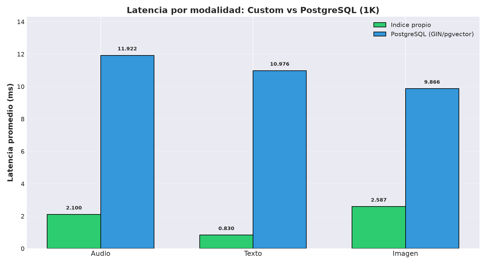 | 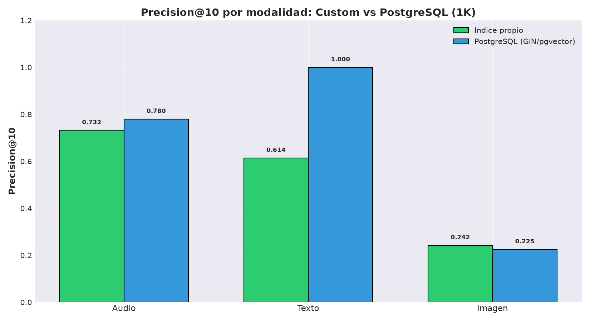 |
| 10K | 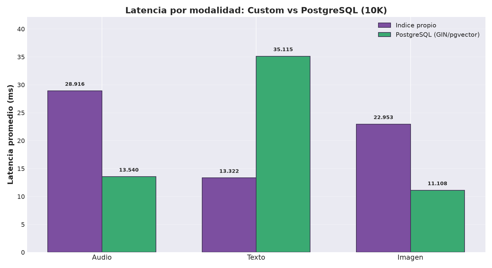 | 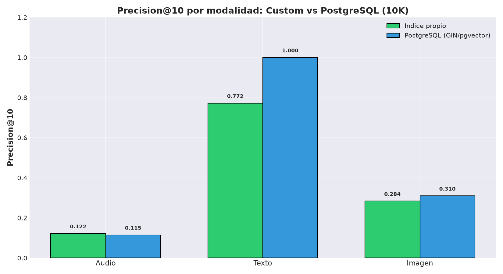 |
| 100K | 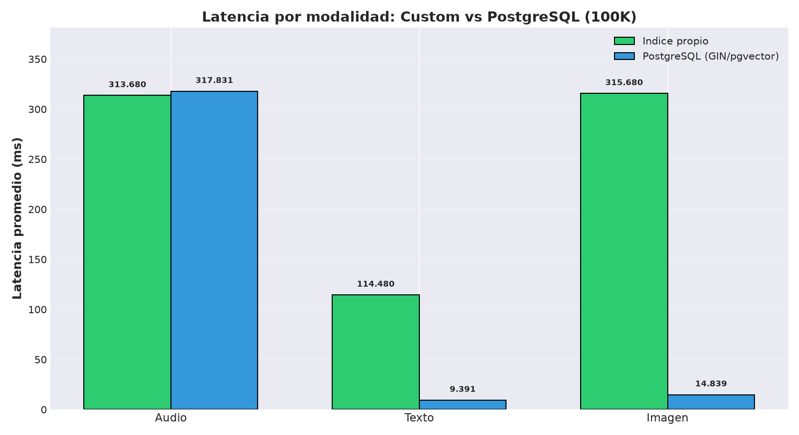 | 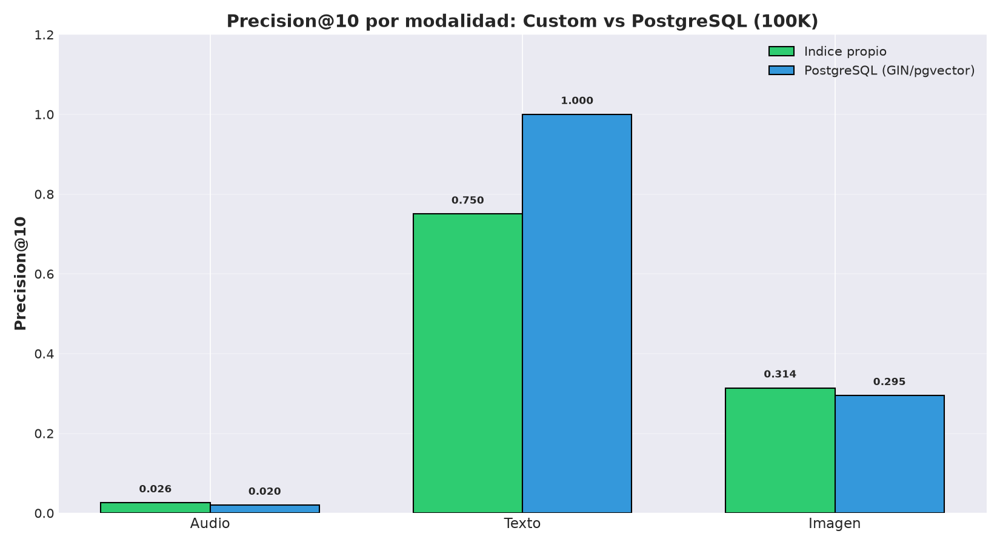 |

Gráfica de escalabilidad general:


### 14.2. Gráficas Por Modalidad

| Modalidad | Latencia | Precisión |
| --- | --- | --- |
| Texto |  | 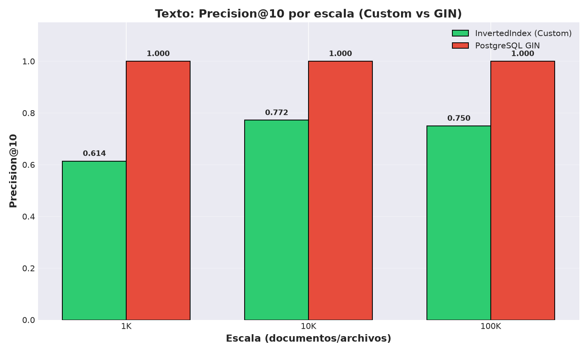 |
| Imagen |  | 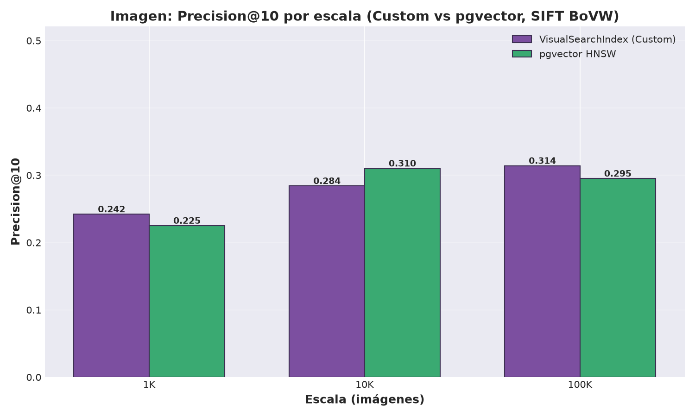 |
| Audio |  | 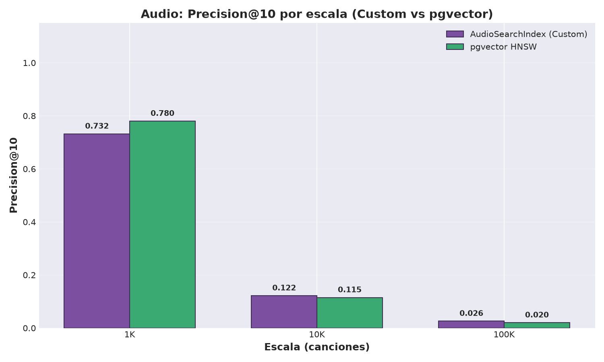 |

## 15. Análisis

### Texto

Texto es la modalidad donde la comparación con PostgreSQL resulta más directa, porque ambos enfoques trabajan sobre contenido textual y estructuras pensadas para recuperación de información. La implementación propia representa cada documento como un histograma TF-IDF sobre un vocabulario de 1000 términos y luego usa un índice invertido con ranking por similitud coseno. PostgreSQL, por su parte, usa `tsvector`, un índice GIN y ranking con `ts_rank`.

En 1K, el índice propio tiene mejor latencia que PostgreSQL GIN: 1.171 ms frente a 10.951 ms. Esto ocurre porque en una colección pequeña el costo de consultar PostgreSQL y usar el motor SQL puede ser mayor que recorrer una estructura propia en memoria. En 10K se mantiene la misma tendencia: el índice propio tarda 13.322 ms y PostgreSQL GIN 35.115 ms.

En 100K la relación cambia. PostgreSQL GIN baja a 113.094 ms, mientras que el índice propio sube a 187.956 ms. Esto tiene sentido porque, conforme aumenta la colección, el índice propio debe rankear más candidatos y depende más de estructuras en memoria. En cambio, GIN aprovecha una estructura persistente optimizada para búsqueda full-text. En esta escala, SPIMI generó 101 bloques y el pico de memoria reportado fue de 1761.82 MB, lo que también evidencia que la construcción del índice textual ya está trabajando con un volumen considerable.

En efectividad, los resultados son bastante cercanos. En 1K, el índice propio obtiene Precision@10 de 0.584 y PostgreSQL 0.550. En 10K y 100K, PostgreSQL queda ligeramente por encima, con 0.730 y 0.795 frente a 0.690 y 0.766 del índice propio. Esto indica que GIN logra ordenar un poco mejor los primeros resultados en escalas mayores, pero la diferencia no es tan grande.

El Recall@10 en texto es bajo, especialmente en 10K y 100K, porque el ground truth se define por categoría de AG News. Cada categoría contiene muchos documentos relevantes, pero el sistema solo devuelve 10 resultados. Por eso, aunque el Top 10 pueda tener varios documentos correctos, la proporción respecto al total de relevantes sigue siendo pequeña. En este caso, Precision@10 describe mejor la calidad inmediata del ranking que Recall@10.

### Imagen

Cada imagen se describe con histogramas basados en SIFT, RootSIFT y color HSV, formando un vector de 116 dimensiones. Esta representación permite capturar tanto patrones locales de forma/textura como información general de color. La implementación propia compara estos histogramas con distancia L2, mientras que PostgreSQL usa pgvector/HNSW.

En 1K, la implementación propia es más rápida que pgvector: 2.587 ms frente a 9.866 ms. Igual que en texto, para una colección pequeña el costo de una búsqueda directa en memoria puede ser menor que pasar por PostgreSQL. Sin embargo, al crecer la escala, la diferencia cambia de forma clara. En 10K, el índice propio sube a 22.953 ms, mientras pgvector se mantiene en 11.108 ms. En 100K, la diferencia ya es muy marcada: 315.680 ms para la implementación propia contra 14.839 ms para pgvector.

Este comportamiento muestra una limitación importante del índice visual propio: la búsqueda crece casi linealmente porque compara contra muchos histogramas en memoria. pgvector/HNSW, en cambio, mantiene una latencia mucho más estable porque utiliza una estructura aproximada de vecinos cercanos. Por ende, para colecciones grandes, pgvector es claramente más conveniente.

En precisión, los dos enfoques quedan bastante cerca. En 1K, la implementación propia obtiene 0.242 y pgvector 0.225. En 10K, pgvector supera ligeramente al índice propio con 0.310 frente a 0.284. En 100K, el índice propio vuelve a quedar un poco por encima, con 0.314 frente a 0.295. Estas diferencias pequeñas sugieren que ambos están trabajando sobre una representación visual similar y que el cambio principal entre ellos está más en la estructura de búsqueda que en la calidad del descriptor.

La precisión visual no es muy alta en términos absolutos porque Fashion200K tiene categorías amplias y visualmente ambiguas. Dos prendas pueden compartir categoría pero diferir mucho en color, forma, textura o estilo. También puede pasar lo contrario: dos imágenes pueden verse muy parecidas aunque no tengan exactamente la misma etiqueta. Esto afecta la evaluación porque el ground truth por categoría no siempre coincide con la percepción visual humana.

El Recall@10 queda bajo por la misma razón que en texto y audio: se recuperan solo 10 resultados dentro de categorías con muchos elementos relevantes. Por eso, en imagen, Precision@10 es más útil para analizar si los primeros resultados que vería el usuario son razonables, mientras que Recall@10 funciona más como una medida de cobertura global.

### Audio

Audio es la modalidad más difícil del proyecto. La representación usa MFCC y un codebook acústico de 512 palabras, lo cual permite convertir cada archivo en un histograma comparable, pero la etiqueta usada como ground truth es el género/carpeta de FMA. Esa etiqueta es bastante amplia: dos canciones del mismo género pueden sonar muy distintas, y dos canciones de géneros distintos pueden compartir ritmo, timbre o instrumentación.

En 1K, la precisión es alta para ambos enfoques: 0.732 en el índice propio y 0.780 en pgvector. Sin embargo, al crecer la escala cae de forma marcada: en 10K baja a 0.122 y 0.115, y en 100K llega a 0.026 y 0.020. Esto no significa necesariamente que los MFCC no capturen información útil, sino que el problema se vuelve más difícil porque hay más distractores y porque el ground truth por género no describe similitud acústica fina.

En latencia, el comportamiento también cambia con la escala. En 1K y 10K pgvector es más estable, con 11.922 ms y 13.540 ms, mientras que el índice propio pasa de 2.100 ms a 28.916 ms. En 100K ambos enfoques quedan muy cerca: 313.680 ms para el índice propio y 317.831 ms para pgvector. Esto sugiere que, para audio, el costo no solo depende de la búsqueda vectorial, sino también de la forma de los histogramas, la distribución de los géneros y el tamaño efectivo de la colección indexada.

El Recall@10 es bajo en todas las escalas porque se compara un Top 10 contra grupos de relevantes muy grandes. Por ejemplo, si una categoría tiene cientos o miles de canciones, recuperar 10 resultados limita naturalmente el recall máximo observable. Por eso, para audio, Precision@10 describe mejor si los primeros resultados son razonables para el usuario, mientras que Recall@10 sirve más como referencia de cobertura global.

## 16. Trade-Offs

| Enfoque | Ventajas | Limitaciones |
| --- | --- | --- |
| Índices propios | Control del algoritmo, baja latencia en escalas pequeñas, fácil de explicar | Búsqueda lineal en imagen/audio, reconstrucción en memoria |
| PostgreSQL GIN | Muy fuerte para texto, persistente, integrado con SQL | Solo aplica directamente a texto |
| pgvector HNSW | Persistencia y búsqueda vectorial aproximada | Requiere ajustar parámetros y mantener la base |

## 17. Conclusiones

El proyecto integra texto, imagen y audio bajo una arquitectura común de recuperación. Aunque cada modalidad necesita extractores distintos, todas terminan en representaciones comparables que pueden indexarse y rankearse.

La comparación muestra que no hay una solución única para todos los casos. Los índices propios son útiles para entender y controlar el proceso de recuperación. Por otro lado, PostgreSQL y pgvector ofrecen una alternativa más preparada para persistencia y escalabilidad.

## 18. Trabajo Futuro

- Ejecutar más experimentos con distintos tamaños de diccionario textual.
- Guardar codebooks entrenados para reducir tiempos de arranque.
- Explorar embeddings modernos para imagen y audio.
